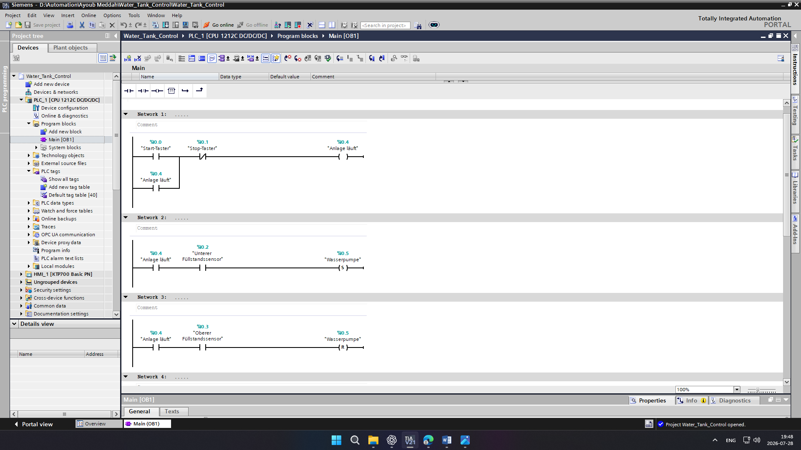
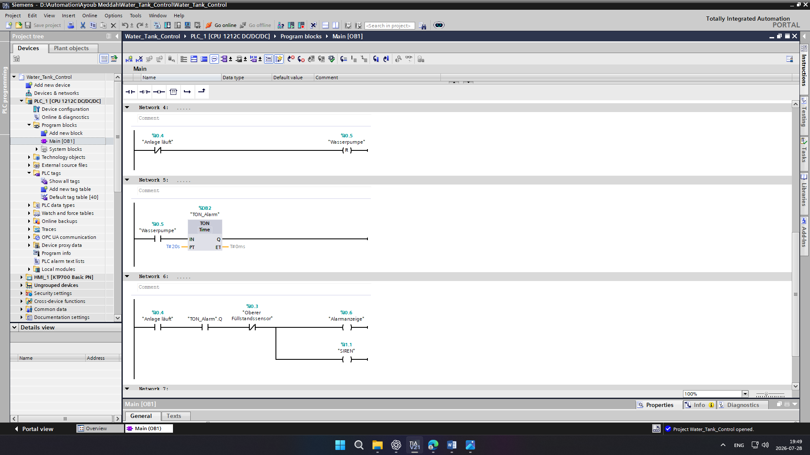
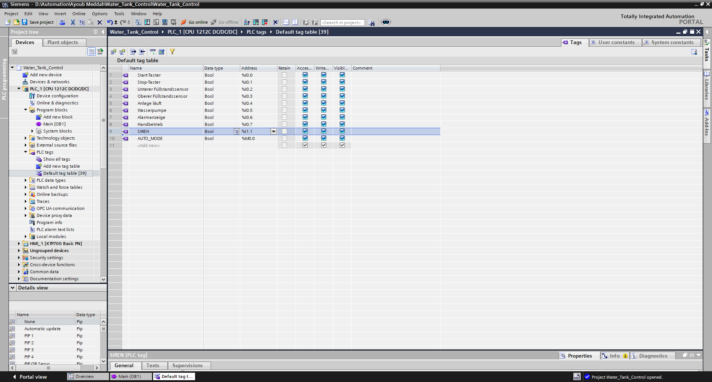
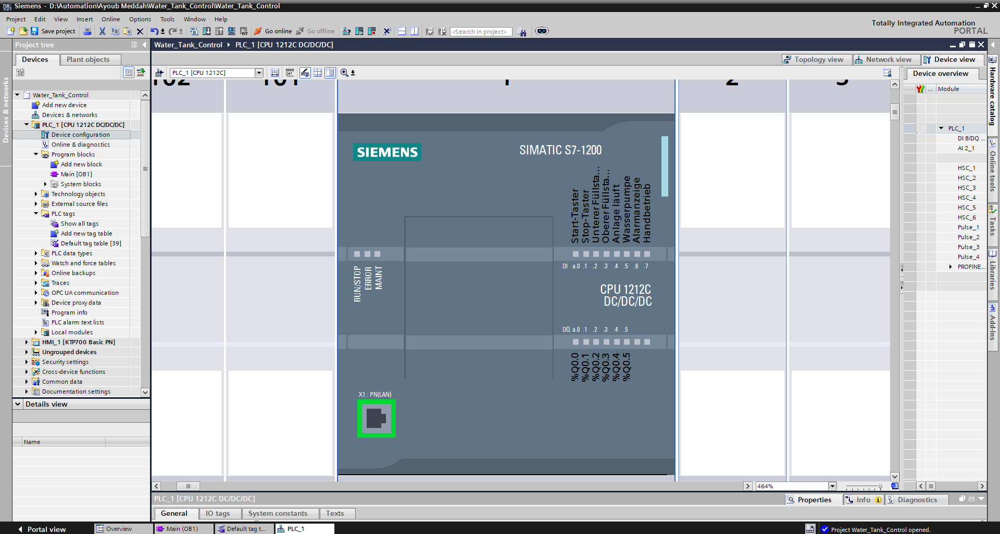

# s7-1200-wassertanksteuerung

Dieses Projekt habe ich erstellt, um die automatische Steuerung eines Wassertanks zu realisieren. Die Anlage überwacht den Wasserstand und steuert die Wasserpumpe automatisch. Dadurch wird verhindert, dass der Tank leerläuft oder überfüllt wird. Zusätzlich verfügt das System über eine Alarmfunktion, falls der gewünschte Wasserstand nicht innerhalb einer festgelegten Zeit erreicht wird.

---

## Verwendete Software und Hardware

- Siemens TIA Portal V17
- Siemens S7-1200 CPU 1212C DC/DC/DC
- Ladder Logic (LAD)

---

## Ladder Logic

Die Anlage wird über einen Start- und Stopptaster aktiviert. Sinkt der Wasserstand bis zum unteren Füllstandsensor, wird die Wasserpumpe automatisch eingeschaltet. Sobald der obere Füllstandsensor erreicht wird, schaltet sich die Pumpe wieder aus.

Zur Erhöhung der Betriebssicherheit überwacht ein Timer die Laufzeit der Pumpe. Wird der obere Füllstandsensor innerhalb der vorgegebenen Zeit nicht erreicht, werden eine Alarmanzeige und eine Sirene aktiviert.

### Network 1–3

Start-/Stopp-Steuerung sowie automatisches Ein- und Ausschalten der Wasserpumpe.

### Network 4–6

Überwachung der Pumpenlaufzeit mit Alarm- und Sirenenfunktion.

---

## PLC-Tags

Start-Taster (%I0.0): Startet die Anlage.

Stop-Taster (%I0.1): Stoppt die Anlage.

Unterer Füllstandsensor (%I0.2): Erkennt den niedrigen Wasserstand.

Oberer Füllstandsensor (%I0.3): Erkennt den maximalen Wasserstand.

Anlage läuft (%Q0.4): Zeigt den aktiven Betrieb an.

Wasserpumpe (%Q0.5): Steuert die Pumpe.

Alarmanzeige (%Q0.6): Zeigt eine Störung an.

SIREN (%I1.1): Aktiviert die Sirene im Alarmfall.

Handbetrieb (%Q0.7): Ermöglicht den manuellen Betrieb.

AUTO_MODE (%M0.0): Aktiviert den Automatikbetrieb.

---

## Hardware-Konfiguration

Die Hardware-Konfiguration zeigt die verwendete Siemens S7-1200 CPU und die Gerätekonfiguration des Projekts.

